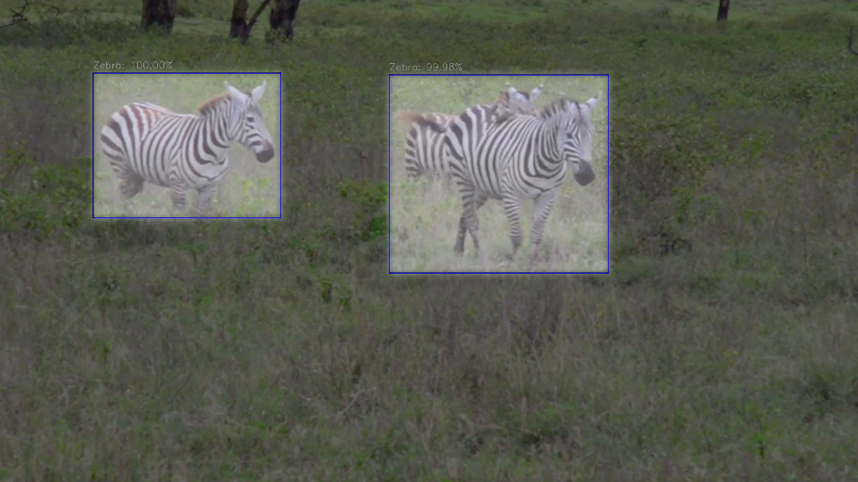

# Object-Recognition

Проект нацелен на реализацию алгоритма компьютерного зрения для классификации объектов на видео, разделяя их на два или более классов. 

В качестве примера двух таких классов я выбрал `horse` и `zebra`. Для обучения и валидации модели использовались данные, собранные из различных открытых источников.



## Установка

Для начала вам потребуется клонировать репозиторий:

```bash
!apt-get install git
!git clone https://github.com/narumiruna/efficientnet-pytorch.git
```

Затем установите `mlconfig` с помощью pip: 
```bash 
!pip install mlconfig
```

После установки вам необходимо внести несколько изменений в YAML файл, чтобы настроить параметры модели под ваши нужды.


